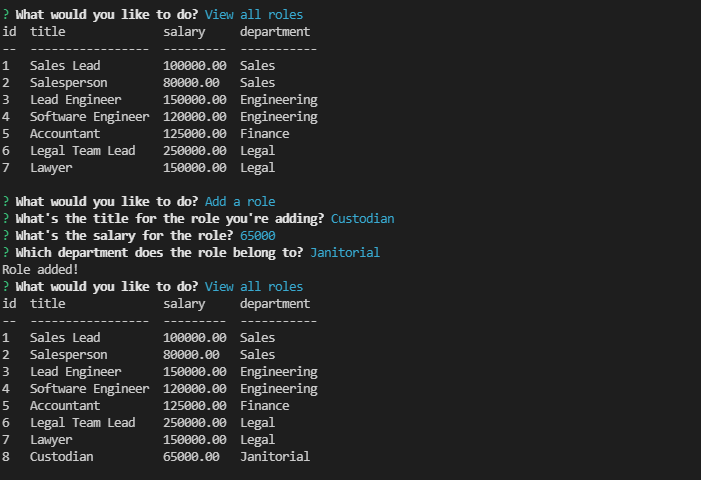

# 12 SQL: Employee Tracker

our challenge this week is to build a command-line application to manage a company's database of employees using Node.js, Inquirer, and MySQL.

## Steps
* Created Database file
* Created Schema file with tables
* Created Seed file
* installed inquirer, mysql2 and console.table
* added all the requires at the top of the index file
* created the base prompt to initiate the questions
* created the switch statmetns to execute the function chosen by the user
* created each function to view all departments, view all roles, view all employees, 
    add a department, add a role, add an employee, and update an employee role
* tested to make sure everything functioned properly and that the tables were being updated accordingly
## Screenshots

